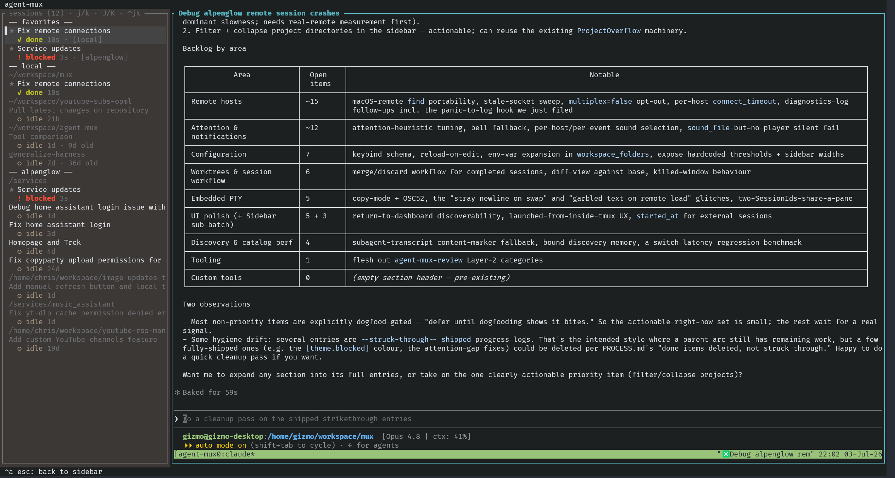

# Agent Mux

Mux is a terminal-first multiplexer for managing multiple Claude Code conversations across local and remote hosts.



## Installation & Setup

Mux can be installed via Cargo:

```bash
cargo install agent-mux
```

Alternatively, you can run it via nix:
```bash
nix run github:gizmo385/mux
```

Or install it via nix:
```bash
nix profile install github:gizmo385/mux
```

To enable notifications, you'll want to install the Claude code hooks on your local machine and any
remote hosts that you want notifications on:

```bash
agent-mux install-hooks
```

## Keybinds

The dashboard discovers local Claude Code sessions, groups them under host headers (`── local ──`, then any configured SSH hosts alphabetical) with dim project sub-headers beneath each host. Each row leads with its title (from `.agent-mux/task.toml` or Claude's auto-generated `aiTitle`, falling back to a short session-id suffix); the title dims when no live tmux pane matches the session (Enter will spin up a fresh `claude --resume` rather than fast-switch into an existing pane).

- `↑`/`↓` or `j`/`k` — navigate the list
- `J`/`K` — jump to the next / previous **project**. Lands on the first session of the target project; wraps. No-op when only one project is on screen.
- `Ctrl-j`/`Ctrl-k` — jump to the next / previous top-level **section**: the Favorites group, the Tools group, or a host. The coarsest jump, one level up from `J`/`K`. Lands on the section's first row; wraps at the edges; no-op when only one section is on screen.
- `Ctrl-P` — **quickswitcher**: a fuzzy-jump modal over *everything* you can attach to — every session (most-recently-active first), running tool launches, and offline favorites. Type a few characters of the title, project, or host; the list ranks best-match-first (contiguous and word-start hits win). `Enter` attaches to the highlighted entry immediately; `↑`/`↓` (or `Ctrl-p`/`Ctrl-n`) move; `Esc` cancels. Pure in-memory filtering over a snapshot taken when the modal opens, so it never blocks on I/O. This is the "which window was that conversation in?" answer: one chord, a few letters, you're there. (Picking an offline favorite jumps to its placeholder and reports "waiting for host" rather than attaching, since there's no live session yet.)
- `Enter` — attach to the selected session inside an embedded terminal pane on the right side of the dashboard; the list collapses to a 40-column sidebar on the left while the pane has focus. Press `Ctrl-a Esc` to return focus to the sidebar without killing the PTY — the sidebar widens while focused so longer titles are readable, then snaps back to compact when you re-enter the session; press `Enter` on a different row to attach to that session instead. (`--no-embed` reverts to the legacy behaviour: `tmux switch-client` from inside tmux, `tmux attach` as a subprocess outside.)
- `t` — open `$SHELL` in the session's cwd, hosted inside the embedded pane. The terminal joins the Tools sidebar group (`⚒ terminal · <project> · [<host>]`) so you can navigate back to it any time without having to find the source session row again. Each press creates a new tools row; the row vanishes on `exit`.
- `n` — create a new session: pick a repo, name a task, confirm the base branch. A git worktree is created in `<workspace>/.agent-mux-worktrees/<repo>-<task>/` (a hidden sibling of the parent repo) and `claude` is launched in it. The picker pre-selects the repo of the currently-highlighted session (or at least its host) so spawning siblings stays in-context.
- `N` (Shift+n) — same picker, no worktree: pick a repo and `claude` launches in the repo root directly. No task name, no base branch, no `.agent-mux/task.toml`. For quick exploratory chats or attaching to a checkout where you already have live edits. The new session lands in the embedded pane the same way `n` does.
- `r` — rename the selected session. Opens an inline overlay above the footer; type the new name, `Enter` saves, `Esc` cancels. The override persists to `~/.cache/agent-mux/session_names.json` and survives restarts. Committing an empty string clears the override and lets the auto-derived title (`task.toml` task / Claude's `aiTitle` / first user message / cwd basename) take back over. A later-arriving AI title does not clobber your rename — once you named something, you meant it.
- `f` — toggle favorite for the selected session. Favorited sessions surface in a pinned `── favorites ──` group at the very top of the sidebar (sorted alphabetically by title, host label suffixed) so frequently-attended conversations stay in a stable position even as the activity-driven natural-tree ordering reshuffles. A `★` glyph marks both the pinned copy and the natural-tree copy. Favorites persist to `~/.cache/agent-mux/favorites.json` and survive restarts. A favorite whose live session isn't loaded yet — its remote host is still connecting after a restart, or is offline — renders as a dimmed *unconfirmed* placeholder (last-known title, `⋯` in place of activity) rather than vanishing; it turns into a normal row the moment discovery surfaces the session. Pressing `f` on a placeholder removes a favorite whose session is gone for good. Search narrowing also hides favorites (live or placeholder) that don't match the query. Inside the delete-worktree modal, `f` instead flips the force toggle (modal-local binding).
- `d` — delete the selected session's worktree (worktree-backed sessions only — sessions started outside a worktree are skipped with a status line). Opens a confirmation modal showing the task, path, and host plus a `[ ] force` toggle (`f` to flip on/off); `Enter` confirms, `Esc` cancels. Without force, git refuses on uncommitted changes — re-confirm with force on if that's what you want. The branch the worktree was on, the transcript file, and any remote `agent-mux-<id>` tmux session are left alone — clean those up yourself if you want them gone.
- Custom tool keybinds — add `[[tools]]` entries to `~/.config/agent-mux/config.toml` and the dashboard will dispatch user-defined keybinds that launch a terminal tool in the selected session's cwd. Same dispatch family as `t: terminal`: inside tmux a new window opens with the command; outside tmux the TUI suspends and runs the command directly. `{cwd}` and `{host}` in command tokens are substituted at fire time. Keys are validated against built-ins at load (collisions are rejected, not silently overridden). Example: a binding `key = "g"`, `command = ["lazygit"]` makes `g` open lazygit in the selected worktree.
- `/` — search/filter sessions by title, project directory, or host (case-insensitive substring). Type to narrow live, `Enter` to apply (keeps filter and returns focus to the list), `Esc` to clear and exit, `/` again to edit the active filter.
- `q` / Ctrl-C — quit (in sidebar focus only; inside the embedded pane, Ctrl-C interrupts the running child, the standard tty behaviour)

## Configuration

Optional `~/.config/agent-mux/config.toml`:

```toml
# Top-level workspace_folders must be absolute paths — they're fed to
# every host's scan (local + remotes that inherit), and a tilde here
# would bake in the local user's home for everyone. Tilde at the top
# level errors loudly at load. Use a per-host block (below) for
# tilde-relative paths.
workspace_folders = ["/home/gizmo/workspace", "/home/gizmo/code"]

# Remote hosts. Each table is one SSH-reachable machine whose Claude
# Code sessions show up alongside your local ones at startup. Per-host
# `workspace_folders` lets `n` create sessions on the remote; omit it
# to inherit the top-level list.
[hosts.alpenglow]
ssh = "alpenglow"  # ~/.ssh/config alias, or "user@host"
# transcript_root = "~/.claude/projects"  # default; tilde survives, remote shell expands
# workspace_folders = ["~/workspace"]     # per-host tildes preserved; remote shell expands

# Notification behaviour. Every field has a default; the whole section
# is optional. Quiet-hours and per-event sound customization are not
# yet supported.
[notifications]
enabled = true          # master on/off
sound = false           # play the OS "default" notification sound
disabled_hosts = []     # host labels to silence entirely
# sound_file = "/System/Library/Sounds/Tink.aiff"
                        # path to an audio file to play instead of the
                        # OS default. Must be an absolute path — tildes
                        # are rejected at load (consistent with the
                        # top-level `workspace_folders` rule).
                        # macOS uses `afplay` (handles mp3/wav/aiff/m4a);
                        # Linux tries ffplay then paplay. When set, takes
                        # precedence over sound=true and the OS
                        # notification itself stays silent so the file
                        # plays alone. Test it via `agent-mux notify-test`.
# backend = "auto"      # one of: auto, dbus, osascript, wsl-toast.
                        # auto picks per-OS at startup; explicit values
                        # override the probe. The picked backend is
                        # logged to stderr at startup so silent failures
                        # become visible in your scrollback.

# Theme overrides. Pick a built-in palette via `preset`, then optionally
# override individual fields. Each value is a string: named ANSI colour,
# `bright_*` variant, or `#RRGGBB` hex. Empty string (or the literal
# "default") clears that field — useful for subtracting a colour from a
# preset. Bad names fail loudly at load.
#
# Elements: needs_input (the green "done" accent), blocked (the red
# "answer me" accent; falls back to needs_input when unset), working,
# idle, unknown — plus four structural colours: focus_border (the focused
# pane's border, default cyan), selection (the selected-row highlight
# background, default ANSI 238), background (painted behind the content/
# header/footer and the embedded terminal's default cells), and
# sidebar_bg (the sidebar panel, set a shade above `background` so the
# sidebar reads as a distinct panel; falls back to `background` when
# unset). The attention accents show in `agent-mux themes`; the
# structural ones are config-only. The coloured presets ship a dark
# `background` + a lighter `sidebar_bg`; `default` and `mono` leave both
# unset so agent-mux composes with your terminal's own background. Note:
# the embedded terminal only picks up `background` in the cells Claude
# Code leaves at terminal-default — agent-mux never reconfigures tmux or
# Claude Code, so a fully matched pane needs your terminal theme to agree.
#
# Built-in presets (coloured ones ship a subtle dark background):
#   "default"   — green done / red blocked / amber working / dim idle; no background.
#   "bright"    — high contrast; every attention state in bright_* variants.
#   "mono"      — no colours at all (modifiers like bold/dim still apply); no background.
#   "warm"      — sunset palette: reds, ambers, earthy browns, olive done.
#   "cool"      — ocean palette: blues, teals, sea-green done (blocked stays rose).
#   "solarized" — canonical Solarized accents over base03 (clear `background` for light bg).
#   "gruvbox"   — Gruvbox bright variants; earthy / retro on dark terminals.
#   "nord"      — Nord aurora + frost; slate tones with aurora-coloured events.
#
# With no `[theme]` section, the "default" preset applies.
[theme]
preset = "bright"
needs_input = "#5fd75f"    # override one field on top of the preset
blocked = "#ff5555"        # colour "answer me" apart from "done"

[ui]
sessions_per_project = 5   # cap rows per project; the rest collapse behind
                           # "+ K more". 0 = no cap. Lifted while searching.
```

Each project in the sidebar shows at most `[ui] sessions_per_project` of its most-recent sessions (default 5); any extras collapse behind a dim `+ K more` line. The cap keeps tall two-line rows from letting a busy project flood the sidebar — and it's lifted whenever you open search (`/`), so filtering always shows every match. Favorited sessions are unaffected (they're pinned at the top regardless).

The `n` keybind picks from repos found in `workspace_folders` (depth-1 scan). Top-level paths must be absolute; per-host `workspace_folders` accept tildes (the remote shell expands them against the remote user's home). Env-var expansion is not supported.

### Remote sessions

Pressing `Enter` on a remote session runs `ssh -t <target> tmux attach -t <pane>` over the host's existing `ControlMaster` connection — by default the resulting tmux client lives inside the embedded pane next to the sidebar; with `--no-embed` it takes over your whole terminal as a foreground subprocess. Either way, what you interact with is the remote tmux's UI.
